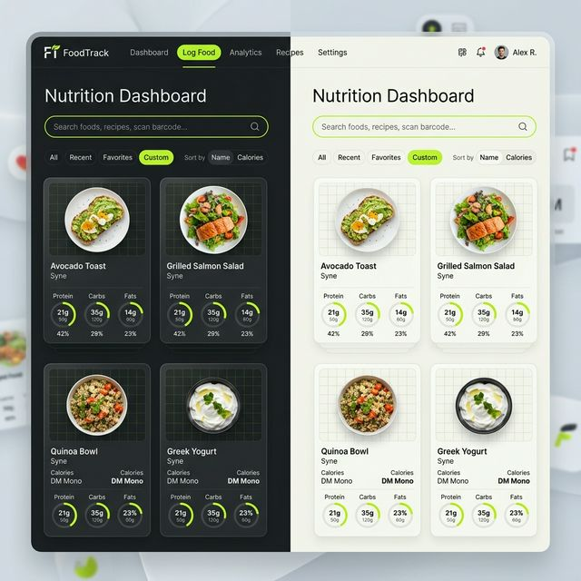

# FoodTrack — Nutrition Intelligence

FoodTrack is a clean, modern web application that provides real-time nutrition information for thousands of food products. Powered by the [Open Food Facts API](https://world.openfoodfacts.org/), it helps you understand exactly what you're eating with high-precision data and a premium user interface.

## ✨ Features

- **Instant Search**: Quickly find nutrition data for over 2 million products.
- **Smart Filtering**: Filter by low-calorie, high-protein, or low-sugar categories.
- **Detailed Macronutrients**: See per-100g breakdowns for energy, protein, fat, carbohydrates, fiber, and more.
- **Nutri-Score Integration**: Visual quality indicators for all products.
- **Dual Theme Support**: Switch between Dark (Default) and Light modes.
- **Responsive Design**: Fully optimized for desktop and mobile devices.
- **Persistence**: Automatically remembers your preferred color theme.

## 🛠️ Tech Stack

- **HTML5**: Semantic structure.
- **Vanilla CSS**: Custom design system with glassmorphism, grid backgrounds, and CSS variables.
- **JavaScript (ES6+)**: Functional logic, API integration, and theme state management.
- **Data Source**: [Open Food Facts](https://world.openfoodfacts.org/) (Open Database License).

## 🚀 Getting Started

1.  Clone or download the repository.
2.  Open `index.html` in any modern web browser.
3.  Start searching for your favorite food (e.g., "Greek Yogurt", "Oats", "Banana").

## 📂 Project Structure

- `index.html`: The main entry point and UI layout.
- `style.css`: Custom CSS design system and theme definitions.
- `app.js`: Application logic and API communication.
- `README.md`: Project documentation.

## 📜 Credits & License

- **Data**: All product information comes from the open database of [Open Food Facts](https://world.openfoodfacts.org/).
- **Design & Code**: Created with a focus on modern, performant, and accessible frontend practices.

---
*FoodTrack © 2026 — Nutrition Intelligence for all.*
